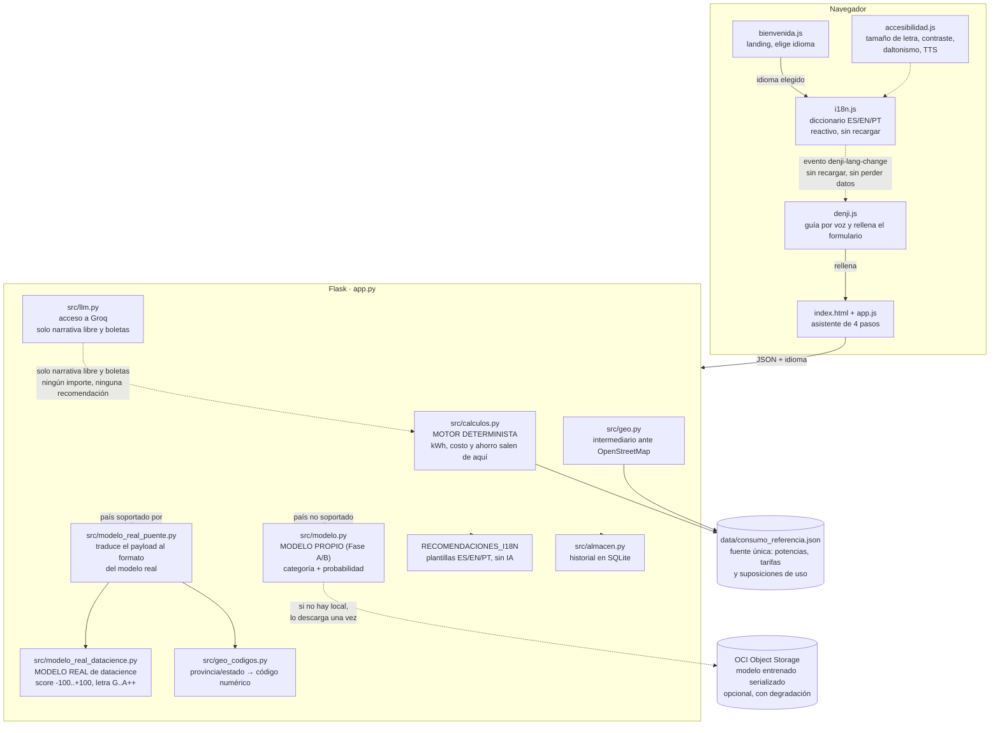
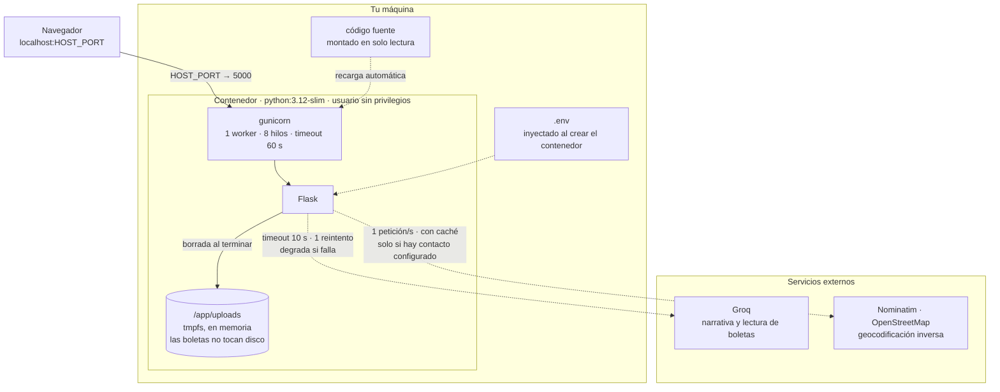
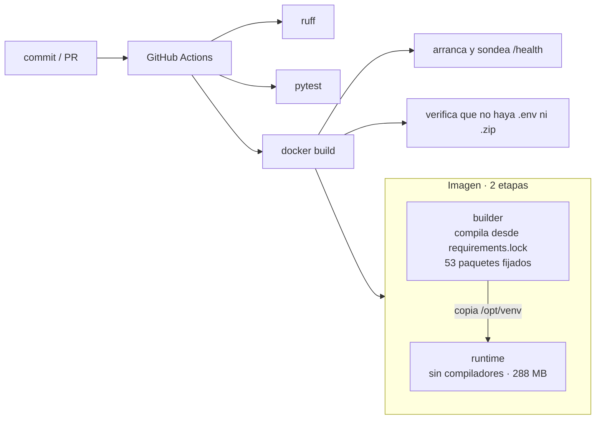

# ⚡ Denji Energy Advisor — Asesor Energético Inteligente

Plataforma web para diagnosticar el consumo eléctrico de un hogar, estimar su ahorro potencial y dar
recomendaciones concretas. Soporta **24 países** de América y España, cada uno con su moneda y
tarifa, y funciona en **español, inglés y portugués**.

> **Los números son deterministas.** El cálculo lo hace [`src/calculos.py`](src/calculos.py) con
> física básica —potencia × tiempo, calor específico del agua— y el modelo de lenguaje **solo redacta
> la narrativa libre y lee las boletas**. Ningún importe, ninguna recomendación, sale de un LLM. Esta
> separación es deliberada: evita que el sistema alucine cifras de ahorro, y hace que la app funcione
> completa —incluidos los 3 idiomas— aunque Groq no esté configurado.

**Contexto.** Responde a las bases del hackathon *EnergiAI – Inteligencia para el Consumo
Energético*, versionadas en [`docs/EnergiAI.pdf`](docs/EnergiAI.pdf).

> ✅ **Cumple los entregables obligatorios.** Dos modelos de clasificación conviven: el propio
> ([`notebooks/energiai.ipynb`](notebooks/energiai.ipynb), Regresión Logística elegida por evidencia
> sobre Random Forest) y el real de datacience
> ([`src/modelo_real_datacience.py`](src/modelo_real_datacience.py), copia mecánica del script
> original, validada corriéndolo de verdad y comparando la salida), más persistencia en Object
> Storage de OCI ([`src/oci_storage.py`](src/oci_storage.py), con degradación explícita si no hay
> credenciales). El estado punto por punto está en
> [`docs/PLAN-HACKATHON.md`](docs/PLAN-HACKATHON.md). Ejemplos reales de uso —tres casos
> contrastantes, corridos contra el servidor, no escritos a mano— en
> [`docs/EJEMPLOS.md`](docs/EJEMPLOS.md).

---

## Arranque rápido

### Con Docker (recomendado)

```bash
git clone https://github.com/No-Country-simulation/Team45-G9.git
cd Team45-G9
cp .env.example .env      # y edita las claves, ver más abajo
docker compose up --build
```

La app queda en **http://localhost:5000**.

> **En macOS el puerto 5000 lo ocupa el receptor de AirPlay.** Usa otro puerto para el host sin tocar
> el interno: `HOST_PORT=5001 docker compose up`, o desactiva *Ajustes → General → AirDrop y Handoff →
> Receptor AirPlay*.

El código va montado en solo lectura con recarga automática: al editar `app.py` o `src/`, gunicorn se
reinicia solo. Para todo lo demás, ver [Comandos](#comandos) al final.

### Sin Docker

Requiere **Python 3.12+**.

```bash
python3 -m venv .venv && source .venv/bin/activate   # Windows: .venv\Scripts\activate
pip install -r requirements.txt
cp .env.example .env
python app.py
```

---

## Configuración

Todas las variables viven en `.env`, que **nunca** se versiona ni entra en la imagen de Docker.
[`.env.example`](.env.example) las documenta una a una; estas son las que importan:

| Variable | Qué hace | ¿Obligatoria? |
|---|---|---|
| `GROQ_API_KEY` | Narrativa libre y lectura de boletas | No, pero sin ella se degrada |
| `NOMINATIM_CONTACTO` | Correo de contacto del equipo | Para detectar la ubicación |
| `GROQ_TIMEOUT_S` | Segundos antes de abandonar una llamada al modelo | No (10) |
| `OCI_BUCKET_NAMESPACE` / `OCI_BUCKET_NAME` | Descargar el modelo entrenado desde Object Storage | No — sin ellas usa el modelo que ya tenga en local |
| `RATELIMIT_STORAGE_URI` | Redis, si se usa más de un worker | No (memoria) |
| `ENABLE_API_DOCS` | Sirve el contrato en `/openapi.yaml` | No (apagado) |
| `HOST_PORT` | Puerto del host, separado del interno | No (5000) |
| `INSTALAR_DOCS` | Mete Swagger UI en la imagen al construirla | No (0) |
| `FLASK_DEBUG` | **Dejar en 0.** El depurador de Werkzeug permite ejecución remota de código | No (0) |

**La aplicación funciona sin ninguna clave.** Sin `GROQ_API_KEY` el diagnóstico, las recomendaciones y
la interfaz se calculan y traducen igual —son deterministas y por plantilla, no dependen de un LLM—;
solo la narrativa libre cae a un texto de respaldo, marcado como tal en el campo `narrativa_fuente`.
Sin `NOMINATIM_CONTACTO` no se detecta la ubicación y se pide a mano; es deliberado: su política de
uso exige identificar la aplicación, y es preferible perder la función antes que hacer peticiones sin
identificar contra un servicio comunitario gratuito. Sin las variables de OCI, el modelo entrenado se
sirve desde el archivo local (`modelos/clasificador_energetico.joblib`), sin intentar conectarse.

---

## Cómo funciona



El modelo de lenguaje **nunca calcula**: recibe cifras ya cerradas por `calculos.py` y solo redacta
la narrativa libre. Hay **dos modelos de clasificación**, no uno: el propio (Fase A/B, entrenado con
un dataset sintético) da `categoria`/`probabilidad`; el real de datacience (validado idéntico contra
el script original que entregaron, corriéndolo de verdad) da `score_eficiencia`, `letra_eficiencia` y
`recomendaciones_modelo_real`, y es el que manda en el texto de "acción principal" cuando está
disponible —para 35 países, con modelo propio para USA/Chile y "modelo prestado" (Canadá⇒USA,
resto⇒Chile) para los demás—. Si el país no está entre esos 35 (España, Puerto Rico), se degrada al
modelo propio. Ninguna recomendación depende de un LLM para traducirse: viven como plantillas en
`RECOMENDACIONES_I18N`, así que funcionan en los 3 idiomas aunque Groq no esté configurado.

### Infraestructura



Las flechas punteadas son **opcionales**: si Groq o Nominatim no responden, o no están configurados,
la aplicación sigue funcionando con menos prestaciones. El diagnóstico nunca depende de ellos.

Un solo worker con hilos, y no varios procesos, porque el límite de tasa y la caché de
geocodificación viven en la memoria del proceso. Escalar exige antes apuntar `RATELIMIT_STORAGE_URI`
a Redis.

### Construcción y entrega



### Dos formas de estimar el consumo

1. **Declarado.** Escribes los kWh de tu boleta, o la subes y se extraen solos.
2. **Estimado.** Declaras tu equipamiento y se calcula artefacto por artefacto.

Si no das ninguno de los dos, el resultado es 0 con `fuente_consumo: "sin_datos"`. No se inventa una
cifra de relleno.

### De dónde sale el ahorro

De la suma real del consumo evitable de cada artefacto: lo que gasta un equipo en modo de espera
frente a lo que gastaría desconectado — incluidos los cargadores que la persona declara como
enchufados sin usar (`consumo_mensual_standby()`, la misma función para todos los casos). Se calcula
siempre, incluso cuando declaras el consumo de tu boleta, porque sin desglose no hay forma de saber
dónde está el ahorro.

> **Limitación conocida.** Hoy solo se monetiza el consumo fantasma. Las recomendaciones textuales
> sugieren ahorros mayores —bajar el aire acondicionado a 24 °C, lavar en frío, cambiar a LED— y
> ninguno de ellos entra todavía en la cifra. El `ahorro_estimado` es, por tanto, conservador.

### El modelo entrenado (Fase A/B)

La categoría de eficiencia (`Eficiente` / `Moderado` / `Ineficiente`) y su `probabilidad` salen de un
modelo supervisado real, no de umbrales fijos ni de un LLM:

- **Dataset:** sintético, generado con semilla fija (`scripts/generar_dataset.py`) muestreando
  perfiles de hogar plausibles y calculando su consumo con el motor físico real del proyecto
  (`calculos.estimar_desde_perfil`) — no es ruido aleatorio, es internamente coherente con lo que la
  API ya calcula.
- **Notebook:** [`notebooks/energiai.ipynb`](notebooks/energiai.ipynb), con las seis secciones que
  piden las bases (EDA, patrones, transformación de variables, entrenamiento, evaluación,
  serialización). Corre de principio a fin sin intervención.
- **Modelo elegido por evidencia, no por preferencia inicial:** el plan proponía Random Forest con
  Regresión Logística como línea base. En la práctica, la Regresión Logística ganó (97,3% de
  exactitud contra 91,7% del Random Forest ya ajustado) — el motor calcula el consumo como una suma
  lineal de watts × horas × frecuencia, así que un modelo lineal le queda mejor a este problema. El
  notebook documenta la comparación completa.
- **Serialización:** `modelos/clasificador_energetico.joblib` + `modelos/metadatos.json` (versión de
  scikit-learn, fecha, métricas, y el orden exacto de las features — sin esto último, un
  reordenamiento futuro de columnas produce predicciones erróneas en silencio).
- **Degradación:** si `modelos/clasificador_energetico.joblib` no existe (clon que no corrió el
  notebook, o antes de que Fase E lo descargue de OCI), `src/modelo.py` cae a los umbrales fijos
  anteriores (250 / 450 kWh) y lo declara en `fuente_clasificacion: "umbrales"` — nunca se inventa
  una probabilidad sin un modelo real detrás.

### El modelo real de datacience

Aparte del modelo propio de arriba, el equipo de datacience entregó su **propio modelo de
regresión**, entrenado con encuestas oficiales reales (RECS de EE.UU., encuesta de hogares de Chile
2018 — no un dataset sintético). Da tres cosas que el modelo propio no da:

- **`score_eficiencia`** — escala continua de -100 a +100, basada en comparar el consumo real contra
  el consumo *esperado* para un hogar con esas características (no contra el consumo de otros
  hogares al azar).
- **`letra_eficiencia`** — G a A++ (11 bandas reales, incluidas C+/C- — el modelo las distingue,
  aunque no se mencionaran en la especificación original).
- **`recomendaciones_modelo_real`** — texto generado por su propio motor de reglas, en dólares (así
  vino del script original; no se muestra en pantalla hoy, solo va en la respuesta de la API).

**Cómo se integró, para que quede trazable:** [`src/modelo_real_datacience.py`](src/modelo_real_datacience.py)
es una copia **mecánica** del script que entregaron —ninguna línea de cálculo se retipeó a mano—,
envuelta en una función en vez de leer/escribir archivos. La prueba de que el envoltorio no cambió
nada corre el script original de verdad (guardado intacto en
[`docs/referencia/`](docs/referencia/)) y compara su salida contra la función, para varios países y
perfiles — ver [`tests/test_modelo_real_datacience.py`](tests/test_modelo_real_datacience.py).

Cubre 35 países: modelo propio para **USA** y **Chile** (con clima a nivel de estado/provincia, vía
[`src/geo_codigos.py`](src/geo_codigos.py) — traduce lo que la persona escribió, "california" o la
región completa que entrega la geolocalización, al código numérico exacto que el modelo necesita, sin
que el usuario vea ningún código nunca) y "modelo prestado" para el resto (Canadá toma prestados los
coeficientes de USA; todos los demás, los de Chile). Si el país no está entre los 35 (España, Puerto
Rico), [`src/modelo_real_puente.py`](src/modelo_real_puente.py) devuelve `None` y
[`src/modelo.py`](src/modelo.py) cae al percentil contra el dataset propio — la respuesta declara
cuál se usó en `fuente_score_eficiencia`.

### Consumo vampiro / fantasma

Cuántos cargadores (celular, tablet, notebook) declara la persona como enchufados sin usar, y cuánto
cuesta eso al mes — con el ahorro real de desenchufarlos, no un porcentaje inventado. Usa
`consumo_mensual_standby()`, la misma función de `calculos.py` que ya calculaba el consumo fantasma
de cada electrodoméstico, solo que nadie la había conectado a una pregunta real del formulario hasta
ahora.

### Sistema de idiomas

Español, inglés y portugués, elegibles desde la pantalla de bienvenida o el panel de accesibilidad —
en cualquier momento, sin perder lo que ya se llevaba lleno en el formulario ni recargar la página
(`window.DenjiI18n.setLang()` actualiza el texto en el sitio y avisa a los demás scripts con un
evento; nada depende de un `location.reload()`).

Dos mecanismos de traducción, deliberadamente distintos:

- **La interfaz y las recomendaciones** (`static/js/i18n.js`, `RECOMENDACIONES_I18N` en `app.py`) son
  plantillas fijas en los 3 idiomas — funcionan sin Groq, sin red, y nunca fallan ni tardan, porque es
  texto que ya se conoce de antemano.
- **La narrativa libre** (la que redacta el LLM caso a caso) sí necesita Groq configurado para
  traducirse; si no está disponible, esa parte específica queda en español y el resto de la app sigue
  funcionando igual en el idioma elegido.

La voz de Denji (síntesis del navegador) también respeta el idioma elegido — selecciona la voz
`es-419`/`en-US`/`pt-BR` según corresponda, no siempre español.

### Integración con OCI (Fase E)

El modelo entrenado se descarga desde **OCI Object Storage** al arrancar, si no está ya en local
(`src/oci_storage.py`). Autenticación en dos niveles:

1. **Instance Principal** — sin ninguna clave que gestionar, porque la API ya se aloja en una VM de
   OCI Compute. Requiere un *dynamic group* + *policy* con permiso de lectura sobre el bucket,
   configurado en la consola de OCI (infraestructura, no código).
2. **Config-file** (`~/.oci/config`) — para desarrollo local, en una máquina que no es una VM de OCI.

Sin ninguna de las dos credenciales disponibles, o sin `OCI_BUCKET_NAMESPACE`/`OCI_BUCKET_NAME`
configurados, la app **no intenta conectarse** y usa el modelo que ya tenga en local — mismo
espíritu que la degradación de Nominatim. El estado real (si está configurado, si el modelo vino de
OCI o de local) se puede ver en `GET /health`.

---

## API

El contrato completo está en [`docs/openapi.yaml`](docs/openapi.yaml). Con `ENABLE_API_DOCS=1` se
sirve además en `/openapi.yaml`.

La interfaz visual de Swagger en `/apidocs` no viaja en la imagen por defecto —son ~9 MB de activos
que no pintan nada en producción, donde además la documentación va apagada. Para levantarla:

```bash
INSTALAR_DOCS=1 docker compose build && docker compose up -d   # con Docker
pip install -r requirements-dev.txt                            # sin Docker
```

y `ENABLE_API_DOCS=1` en el `.env`.

| Método | Ruta | Para qué |
|---|---|---|
| `GET` | `/health` | Sonda de vida. No llama a servicios externos |
| `GET` | `/api/paises` | Países soportados con su moneda y tarifa |
| `GET` | `/api/ubicacion` | Coordenadas → ciudad y código de país |
| `POST` | `/api/analisis-energetico` (alias: `/analisis-energetico`) | Análisis del hogar. **El endpoint principal** |
| `GET` | `/api/analisis-energetico` (alias: `/analisis-energetico`) | Historial — últimos análisis (`?limite=`, Fase D) |
| `GET` | `/api/analisis-energetico/{id}` (alias sin `/api/`) | Consulta un análisis guardado por id (Fase D) |
| `POST` | `/api/calcular` | Cálculo por artefacto. Payload **distinto** al anterior |
| `POST` | `/api/subir-boleta` | Extrae consumo y tarifa de una boleta |
| `POST` | `/api/interpretar-campo` | Mapea texto libre a un tipo de vivienda |
| `POST` | `/api/comparar` | Compara artefactos. Catálogo de ejemplo |

El alias sin `/api/` existe porque las bases del hackathon especifican la ruta exacta
`POST /analisis-energetico` (Fase C / decisión H-2) — mismo código, misma cuota de límite de tasa,
ambas rutas apuntan al mismo view function.

Los endpoints que consumen servicios de pago tienen límite de tasa por IP y no piden credenciales;
sin tope, cualquiera podría agotar la cuota.

---

## Desarrollo

### Ejecutar la batería de pruebas

**Con un entorno local** (rápido, para iterar):

```bash
python3 -m venv .venv && source .venv/bin/activate   # Windows: .venv\Scripts\activate
pip install -r requirements-dev.txt
pytest
```

> El `venv/` que hay en el repositorio es de Windows y no sirve en macOS ni Linux. De ahí que el
> entorno nuevo se llame `.venv`, con punto: son directorios distintos y ambos están ignorados por git.

**Dentro de un contenedor** (misma versión de Python que la CI, sin instalar nada):

```bash
docker run --rm -v "$PWD:/app" -w /app python:3.12-slim \
  sh -c "pip install -q -r requirements-dev.txt && pytest"
```

Úsalo si tu Python local no es 3.12: la batería pasa igual en 3.9, pero solo esta vía reproduce
exactamente lo que corre en la CI.

Algunos tests solo corren con `ENABLE_API_DOCS=1` —los de la interfaz visual de la API— y se saltan
en caso contrario. Ninguno llama a Groq ni a OpenStreetMap: la batería funciona sin claves y sin red.

La CI ejecuta linter y tests en cada PR, construye la imagen de Docker, la arranca y sondea
`/health`, y falla si alguien versiona un `.env` o un `.zip`.

### Datos de referencia

[`data/consumo_referencia.json`](data/consumo_referencia.json) es la fuente única de potencias,
tarifas y suposiciones de uso. Cada valor lleva anotada su procedencia, y los que no están
verificados lo dicen explícitamente:

- **Tarifas por país:** referenciales, con el regulador de origen anotado. No están verificadas en
  tiempo real — envía `tarifa_kwh` con el valor de tu propia boleta para obtener importes exactos.
- **`perfil_hogar`:** las horas de uso al día y las veces por semana de cada equipo. Antes eran
  constantes escondidas en el código; ahora se pueden auditar y corregir aquí.
- **Marcados `SIN VERIFICAR`:** la potencia media de la lavadora y las tarifas de siete países.
  Sustituirlos por datos reales antes de presentar esto como asesoría.
- **`categorias_comparables`:** catálogo **de ejemplo**, con todos los precios en `null`.

---

## Estructura

```
Team45-G9/
├── app.py                      Servidor Flask, endpoints, RECOMENDACIONES_I18N
├── src/
│   ├── calculos.py              Motor determinista
│   ├── modelo.py                 Carga del modelo propio (Fase A/B) + score de eficiencia
│   ├── modelo_real_datacience.py Modelo real de datacience, copia mecánica del script original
│   ├── modelo_real_puente.py     Traduce el payload al formato que pide el modelo real
│   ├── geo_codigos.py            Provincia/estado (texto libre) → código numérico
│   ├── oci_storage.py            Sincronización con OCI Object Storage (Fase E)
│   ├── almacen.py                Historial de análisis, SQLite (Fase D)
│   ├── llm.py                   Acceso a Groq
│   └── geo.py                   Geocodificación inversa
├── scripts/generar_dataset.py  Genera data/consumo_hogares.csv (semilla fija)
├── notebooks/energiai.ipynb    EDA, entrenamiento, evaluación, serialización
├── modelos/
│   ├── clasificador_energetico.joblib
│   └── metadatos.json          Versión de sklearn, métricas, orden de features
├── data/
│   ├── consumo_referencia.json
│   └── consumo_hogares.csv     Dataset sintético (Fase A.1)
├── instance/analisis.db        Historial SQLite (no versionado, ver .gitignore)
├── templates/index.html
├── static/
│   ├── css/style.css
│   ├── js/app.js                Lógica del asistente
│   ├── js/denji.js              Asistente guiado
│   ├── js/i18n.js               Diccionario ES/EN/PT, reactivo
│   ├── js/bienvenida.js         Pantalla de bienvenida — elige idioma, geolocaliza
│   ├── js/accesibilidad.js      Panel de accesibilidad (letra, contraste, daltonismo, TTS)
│   ├── img/
│   └── vendor/                 Lucide y la tipografía, servidos localmente
├── tests/                      Batería de pruebas
├── docs/
│   ├── EnergiAI.pdf             Bases del hackathon (la fuente)
│   ├── EJEMPLOS.md               Tres casos de uso reales, contra el servidor (Fase F)
│   ├── openapi.yaml             Contrato de la API
│   ├── reglas_recomendaciones.md  Tabla de datacience detrás de las recomendaciones
│   ├── PLAN.md                  Plan de la auditoría de código
│   ├── PLAN-HACKATHON.md        Qué falta para cumplir las bases
│   ├── DECISIONES.md            Decisiones técnicas y su porqué
│   └── referencia/              Fuentes originales intactas (nunca se importan en producción)
│       ├── Modelo_original_datacience.py
│       └── notebooks/           Metodología: encuestas RECS (USA) y hogares Chile 2018
├── Dockerfile                  Multi-stage, sin privilegios
├── docker-compose.yml
├── requirements.txt            Dependencias directas
├── requirements.lock           Árbol completo fijado (build reproducible)
└── requirements-dev.txt
```

---

## Comandos

Referencia de lo que se usa a diario. Los de Docker asumen que estás en la raíz del proyecto.

### Levantar y parar

```bash
docker compose up -d                 # arrancar en segundo plano
docker compose up                    # arrancar viendo los logs
docker compose down                  # parar y eliminar el contenedor
docker compose restart               # reiniciar sin recrear
docker compose ps                    # ¿está viva? ¿en qué puerto?
docker compose logs -f               # seguir los logs en vivo
docker compose logs --tail 50 app    # las últimas 50 líneas
```

### Cuándo hace falta reconstruir

Editar `app.py`, `src/`, `static/` o `templates/` **no requiere nada**: el código va montado y
gunicorn recarga solo. El resto sí:

| Cambiaste… | Comando |
|---|---|
| El `.env` | `docker compose up -d --force-recreate` |
| `requirements.lock` o el `Dockerfile` | `docker compose up -d --build` |
| Quieres Swagger UI en la imagen | `INSTALAR_DOCS=1 docker compose build && docker compose up -d` |

El entorno se lee al **crear** el contenedor, no en cada petición: por eso un cambio en el `.env`
necesita `--force-recreate` y no basta con `restart`.

### Pruebas y linter

```bash
source .venv/bin/activate            # una vez por terminal

pytest                               # toda la batería
pytest tests/test_calculos.py        # un solo archivo
pytest tests/test_calculos.py::test_hervidor_coincide_con_la_termodinamica   # un solo test
pytest -k tarifa                     # los que coincidan con un nombre
pytest -x                            # parar en el primer fallo
pytest -q --cov=src --cov=app --cov-report=term          # con cobertura
pytest -q --cov=src --cov-report=html && open htmlcov/index.html   # cobertura navegable

ruff check .                         # linter
ruff check . --fix                   # y que corrija lo que pueda
```

### Comprobar que funciona

```bash
curl -s localhost:5001/health | python3 -m json.tool     # estado y qué hay configurado
curl -s localhost:5001/api/paises | python3 -m json.tool # catálogo de países

curl -s -X POST localhost:5001/api/analisis-energetico \
  -H 'Content-Type: application/json' \
  -d '{"pais":"CL","tv":2,"tv_frecuencia":21,"refrigerador":1}' | python3 -m json.tool
```

`/health` dice de un vistazo si las funciones opcionales están activas:

```json
{"estado":"ok","paises":24,"artefactos":31,
 "groq_configurado":true,"geocodificacion_configurada":true}
```

### Diagnosticar problemas

```bash
docker compose logs app | grep -i "GROQ_API_KEY rechazada"   # ¿la clave caducó?
docker compose logs app | grep -iE "error|warning"           # todo lo anómalo
docker compose exec app sh                                   # entrar al contenedor
docker compose exec app printenv | grep -c GROQ              # ¿llegaron las variables?
```

En el navegador, para el asistente de voz —consola con `Cmd+Option+J`—:

```js
denjiDiagnostico()            // navegador, permisos del micrófono, idioma
denjiUltimaTranscripcion      // lo último que se reconoció
```

Y filtra por `[denji:voz]` para seguir cada fase de la escucha.

### Git

```bash
git status --short
git log --oneline -10
git diff                             # cambios sin preparar
git diff --cached                    # los que ya están preparados
```

---

## Tecnologías

| Capa | Stack |
|---|---|
| **Backend** | Python 3.12, Flask 3, gunicorn, flask-limiter |
| **Modelo propio (Fase A/B)** | scikit-learn (Regresión Logística, 97,3% exactitud) + joblib + pandas — entrenado en `notebooks/energiai.ipynb`, servido por `src/modelo.py` |
| **Modelo real de datacience** | Regresión estadística sobre encuestas oficiales (RECS EE.UU., hogares Chile 2018) — copia mecánica y validada del script original (`src/modelo_real_datacience.py`), cubre 35 países |
| **Narrativa y lectura de boletas** | LangChain + Groq (Llama 3.3 70B; visión con Llama 4 Scout) — nunca calcula, solo redacta texto libre |
| **Traducción de interfaz y recomendaciones** | Plantillas propias ES/EN/PT (`static/js/i18n.js`, `RECOMENDACIONES_I18N`) — sin IA, sin red, nunca fallan |
| **Asistente guiado** | Denji (`static/js/denji.js`) — voz en 3 idiomas, mic, sincronización bidireccional con el formulario |
| **Accesibilidad** | `static/js/accesibilidad.js` — tamaño de letra, alto contraste, modos para daltonismo, TTS |
| **Geocodificación** | Nominatim/OpenStreetMap, vía `src/geo.py` (identificado, con caché y límite de tasa) |
| **Persistencia** | SQLite (`src/almacen.py`) — historial de análisis, consultable por id |
| **Almacenamiento del modelo** | OCI Object Storage (`src/oci_storage.py`) — Instance Principal, con degradación a modelo local |
| **Frontend** | HTML5, CSS3, JavaScript ES6+ — sin framework ni CDN |
| **Datos** | JSON de referencia + dataset sintético (`data/consumo_hogares.csv`), cálculo determinista |
| **Infra** | Docker multi-stage, GitHub Actions (lint + tests + build de imagen) |

La interfaz **no hace ninguna petición a servidores externos** salvo las que requieren un servicio
específico (geocodificación, el LLM para narrativa libre, o descargar el modelo desde OCI la primera
vez) — los iconos y la tipografía se sirven desde el propio proyecto, la interfaz y las
recomendaciones se traducen sin salir del servidor, y cada integración externa se degrada
explícitamente si no está disponible, sin tumbar la app.

---

Denji Energy Advisor © 2026 — Equipo Denji
