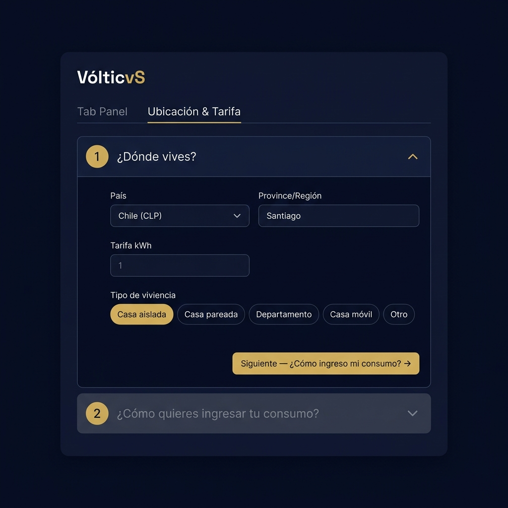

# Propuesta de Diseño de Interfaz (UI) — VólticvS

A continuación, se presenta la propuesta visual para la pantalla de **Ubicación & Tarifa**, diseñada para reducir la carga cognitiva y guiar al usuario paso a paso.

## Vista General

---

## Descripción de la Interfaz

### Paso 1 — ¿Dónde vives? *(expandido por defecto)*

| Campo | Tipo | Descripción |
|---|---|---|
| **País** | Dropdown | Carga dinámica desde `/api/paises`. Ajusta moneda y tarifa referencial. |
| **Provincia / Estado / Región** | Texto libre | Alimenta la estimación climática del modelo. |
| **Valor del kWh** | Número | Pre-relleno con tarifa referencial del país seleccionado. |
| **Tipo de vivienda** | Botones | Casa aislada · Casa pareada · Departamento · Casa móvil · Otro |

El botón **"Siguiente →"** colapsa este paso y expande automáticamente el Paso 2.

---

### Paso 2 — ¿Cómo quieres ingresar tu consumo? *(colapsado por defecto)*

| Opción | Valor asignado | Descripción |
|---|---|---|
| 🟢 Bajo | ~100 kWh/mes | Depto. o consumo mínimo |
| 🟡 Medio | ~225 kWh/mes | Casa promedio |
| 🟠 Alto | ~400 kWh/mes | Casa grande / elevado |
| 🔴 No lo sé | 250 kWh | Promedio estándar |
| ✏️ Tengo mi boleta | Campo numérico | El usuario ingresa el valor exacto |

Adicionalmente, el usuario puede **subir su boleta eléctrica** (PNG, JPG, WEBP o PDF) para que el sistema extraiga automáticamente el consumo y la tarifa real mediante OCR + IA.

---

## Principios de Diseño Aplicados

- **Dark Mode:** Fondo `#090d1f` (navy profundo), paneles `#0f1530`.
- **Acento dorado:** `#f5c518` para elementos activos, botones primarios y número de paso.
- **Tipografía:** Space Grotesk (títulos) + Inter (cuerpo) + IBM Plex Mono (valores numéricos).
- **Interacción:** Pasos colapsables con animación suave (`selectorReveal`). El número del paso activo resalta en dorado; el inactivo en gris.
- **Responsive:** Grid de 2 columnas en desktop → 1 columna en mobile.
